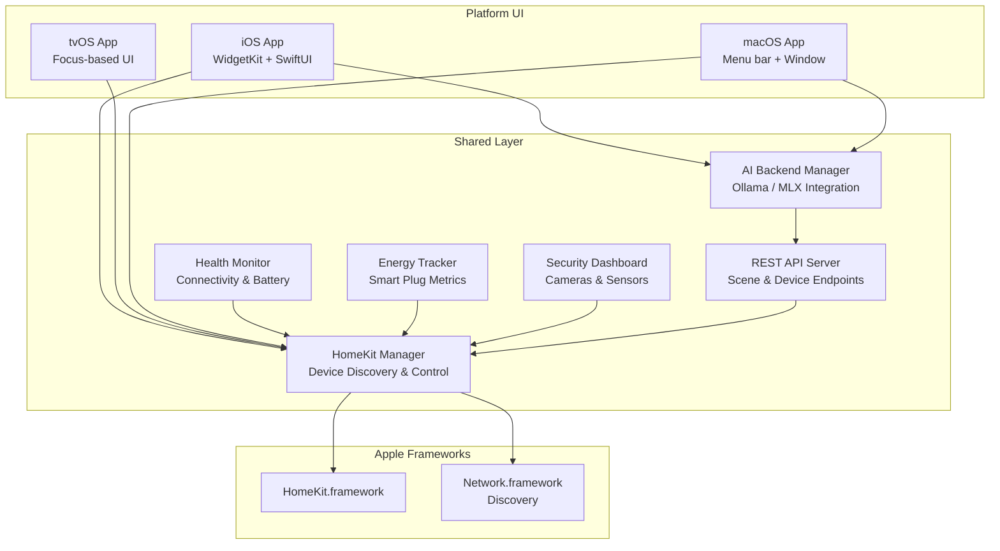
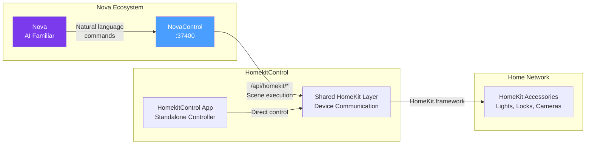

# HomekitControl — Product Overview

**Multi-Platform HomeKit Controller | Part of the Nova Ecosystem**

---

## What It Is

HomekitControl is a native, multi-platform HomeKit controller built entirely in Swift 5.9 and SwiftUI. It provides direct HomeKit.framework access across iOS, tvOS, and macOS — giving users a single codebase that runs on every Apple screen in their home.

It also serves as the foundational technology behind NovaControl's HomeKit integration, providing the battle-tested device communication layer that Nova uses for AI-driven home automation.

---

## Key Capabilities

### Multi-Platform Native Control
- **iOS** — Full device control with WidgetKit home screen widgets for instant access
- **tvOS** — Living room dashboard optimized for Apple TV
- **macOS** — Desktop control panel and background service

### Network Discovery & Health Monitoring
- Automatic detection of HomeKit accessories on the local network
- Device connectivity status, battery levels, and firmware version tracking
- Proactive alerts when devices go offline or need attention

### Security Dashboard
- Unified view of cameras, door/window sensors, and motion detectors
- Real-time security state across all monitored zones
- Event history and anomaly detection

### Energy Tracking
- Power consumption monitoring for smart plugs
- Usage trends and cost estimation
- Identify energy-hungry devices at a glance

### AI-Powered Natural Language Commands
- Ollama integration for local, private natural language processing
- "Turn off all the lights downstairs" parsed and executed locally
- No cloud dependency — all inference runs on-device or on local hardware

### REST API for Programmatic Control
- Scene execution and device manipulation via HTTP
- Foundation for NovaControl's `/api/homekit/*` endpoints
- Designed for AI agent consumption from day one

---

## Quality & Reliability

| Metric | Value |
|--------|-------|
| Tests passing | 329 |
| Platforms | iOS, tvOS, macOS |
| Language | Swift 5.9, SwiftUI |
| Framework | Native HomeKit.framework |
| License | MIT |

---

## Architecture

### Multi-Platform Shared Layer

All three platforms share a common HomeKit communication layer, with platform-specific UI built on top.

### NovaControl Integration

HomekitControl's REST API layer was the original bridge between Nova and HomeKit. That responsibility has since been absorbed into NovaControl, which now handles all HomeKit API calls for the Nova ecosystem.

---

## Ecosystem Role

HomekitControl occupies a specific position in the Nova stack:

| Component | Role |
|-----------|------|
| **Nova** | AI familiar — understands intent, orchestrates actions |
| **NovaControl** | Unified API gateway — routes commands to the right subsystem |
| **HomekitControl** | HomeKit specialist — native device communication and discovery |

The original Nova-facing API (port 37432) has been retired. NovaControl now serves as the single entry point for all AI-driven home automation, calling into HomekitControl's shared device layer when HomeKit operations are needed.

---

## Why It Matters

1. **Native performance** — No bridging layers, no web wrappers. Direct HomeKit.framework access means sub-100ms device response times.
2. **Privacy by design** — All AI inference runs locally via Ollama. No voice recordings or device data leave the network.
3. **Battle-tested** — 329 tests covering device communication, discovery, error handling, and API contracts.
4. **Multi-platform from one codebase** — Write the HomeKit logic once, deploy to phone, TV, and desktop.
5. **AI-ready architecture** — Built for programmatic control from day one, not retrofitted.

---

## Technical Stack

- **Swift 5.9** — Modern concurrency with async/await throughout
- **SwiftUI** — Declarative UI across all platforms
- **HomeKit.framework** — Native Apple home automation
- **Network.framework** — Bonjour/mDNS device discovery
- **WidgetKit** — iOS home screen widgets
- **Ollama** — Local LLM inference for natural language commands
- **REST/HTTP** — JSON API for programmatic access
- **XCTest** — 329 unit and integration tests

---

*Built by Jordan Koch. Part of the Nova ecosystem.*
