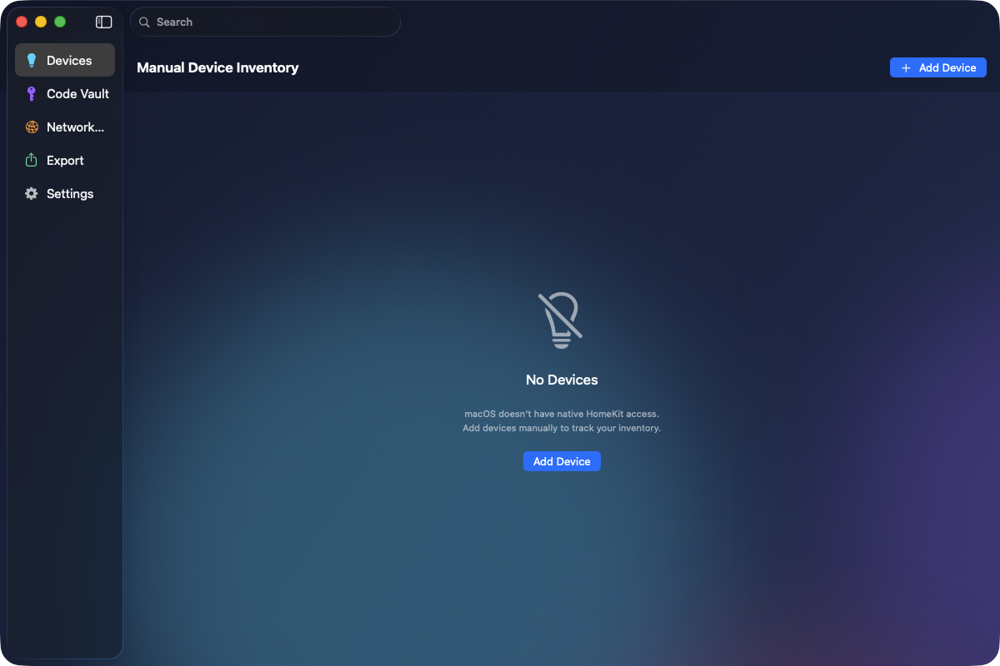

# HomekitControl


A unified multi-platform smart home control app for iOS, tvOS, and macOS.



## Overview

HomekitControl combines the functionality of 5 previous HomeKit projects into a single, unified app:

- **HomeKitAdopter** - Network discovery and security audit
- **HomeKitAssistant** - Basic device control
- **HomeKitRestore** - Setup code vault
- **HomeKitTV** - Full device and scene control
- **SceneFixer** - Scene diagnostics and AI repair

## Features

### iOS
- Full device control (toggle, brightness, color)
- Scene execution and repair
- Network discovery (Bonjour/mDNS (Multicast Domain Name System))
- AI assistant for smart home insights
- Setup code vault with Keychain storage
- Export data (CSV (Comma-Separated Values)/JSON)
- **Home Screen Widget** with device health and quick scenes

### iOS Widget
The HomekitControl Widget provides at-a-glance smart home information directly on your home screen:

- **Small Widget**: Shows unreachable device count and overall health status
- **Medium Widget**: Device health summary + quick scene buttons
- **Large Widget**: Full dashboard with health details, device counts, and favorite scenes

#### Widget Features
- Real-time device health monitoring
- Unreachable device alerts
- Quick scene execution (tap to run)
- Favorite scene management
- Deep links into the main app

#### Setting Up the Widget
1. Long-press on your home screen
2. Tap the "+" button to add a widget
3. Search for "HomekitControl"
4. Choose your preferred size (Small, Medium, or Large)
5. Mark scenes as favorites in the app to see them in the widget

### tvOS
- 10-foot optimized UI with focus navigation
- Device viewing and control
- Scene execution
- Network discovery

### macOS
- HomeKit integration via macOS Shortcuts CLI proxy (v1.1+)
- Scene listing and execution through API or Shortcuts
- Device status monitoring via Shortcuts bridge
- Setup code vault with Keychain and photo storage
- Network scanner
- Full export functionality

## Platform Capabilities

| Feature | iOS | tvOS | macOS |
|---------|-----|------|-------|
| Device Control | Yes | Yes | Via Shortcuts proxy |
| Scene Execution | Yes | Yes | Yes (Shortcuts proxy) |
| Scene Repair | Yes | No | No |
| Network Discovery | Yes | Yes | Yes |
| AI Assistant | Yes | Yes | Yes |
| Setup Code Vault | Yes | No | Yes |
| Export | Yes | No | Yes |
| Home Screen Widget | Yes | No | No |

## Requirements

- iOS 17.0+
- tvOS 17.0+
- macOS 14.0+
- Xcode 16.0+

## Installation

1. Clone the repository
2. Run `xcodegen generate` to create the Xcode project
3. Open `HomekitControl.xcodeproj`
4. Select your target platform and build

## Architecture

```
HomekitControl/
├── Shared/
│   ├── Models/              # Unified data models
│   ├── Services/            # Core services (HomeKit, Network, AI)
│   ├── Design/              # Glassmorphic design system
│   └── Utilities/           # Platform capabilities
├── iOS/                     # iOS-specific views
├── tvOS/                    # tvOS-specific views
├── macOS/                   # macOS-specific views
├── HomekitControl Widget/   # WidgetKit extension
│   ├── HomekitControlWidget.swift    # Main widget (Small, Medium, Large)
│   ├── WidgetData.swift              # Widget data models
│   ├── SharedDataManager.swift       # App Group data sharing
│   ├── Info.plist                    # Widget Info.plist
│   └── HomekitControl_Widget.entitlements
└── Resources/
    ├── Assets.xcassets      # Shared assets
    └── *.entitlements       # Platform entitlements
```

## App Groups

The widget uses App Groups to share data with the main app:
- **Identifier**: `group.com.jkoch.homekitcontrol`

This allows the widget to display real-time device health and scene information synced from the main app.

## License

MIT License - See LICENSE file for details.

## Author

Jordan Koch

Copyright 2026 Jordan Koch. All rights reserved.

---

## More Apps by Jordan Koch

| App | Description |
|-----|-------------|
| [StreamRotator](https://github.com/kochj23/StreamRotator) | Video stream rotation and display management |
| [rtsp-rotator](https://github.com/kochj23/rtsp-rotator) | RTSP (Real Time Streaming Protocol) camera stream rotation and monitoring |
| [TopGUI](https://github.com/kochj23/TopGUI) | macOS system monitor with real-time metrics |
| [NMAPScanner](https://github.com/kochj23/NMAPScanner) | Network security scanner with AI threat detection |
| [MLXCode](https://github.com/kochj23/MLXCode) | Local AI coding assistant for Apple Silicon |

> **[View all projects](https://github.com/kochj23?tab=repositories)**

---

> **Disclaimer:** This is a personal project created on my own time. It is not affiliated with, endorsed by, or representative of my employer.

## Nova / Claude API Integration

This app exposes a local HTTP API on port **37432** for integration with [Nova](https://github.com/kochj23) (OpenClaw AI) and Claude Code.

**Platform:** macOS / iOS / tvOS  
**Auth:** Loopback only (127.0.0.1) — no external network exposure.

### Architecture

| Platform | Backend | How it works |
|----------|---------|--------------|
| iOS / tvOS | Native `HomeKit.framework` | Direct HMHomeManager access |
| macOS | Shortcuts CLI proxy | Calls macOS Shortcuts app via `shortcuts run` CLI |

On macOS, `HomeKit.framework` is not available for native apps (only Mac Catalyst). The API server proxies requests through macOS Shortcuts, which can access HomeKit natively.

### Endpoints

```bash
# Health
curl http://127.0.0.1:37432/api/status       # App status, uptime, backend type
curl http://127.0.0.1:37432/api/ping         # Health check

# HomeKit Data
curl http://127.0.0.1:37432/api/homes        # Home names and IDs
curl http://127.0.0.1:37432/api/accessories  # All accessories with services/characteristics
curl http://127.0.0.1:37432/api/scenes       # Scene names and IDs

# Actions
curl -X POST http://127.0.0.1:37432/api/scenes/execute \
  -H "Content-Type: application/json" \
  -d '{"name": "Good Morning"}'              # Execute a scene by name
curl -X POST http://127.0.0.1:37432/api/refresh  # Trigger data refresh
```

### macOS Shortcuts Setup

The macOS Shortcuts proxy requires these Shortcuts to be created in the Shortcuts app:

1. **"Nova HomeKit Status"** — Queries all Home accessories, outputs JSON array with name, room, type, reachable, services, and characteristics
2. **"List HomeKit Scenes"** — Lists all Home scene names as a JSON array
3. **"Execute HomeKit Scene"** — Receives a scene name as text input and executes it

### Auto-Launch

A launchd agent (`com.jordankoch.homekitcontrol`) keeps the app running and restarts it if it crashes. The API server starts automatically when the app launches.

