# HomekitControl

> **Note:** The Nova API functionality of this app (port 37432) has been retired from active use. All HomeKit API access for Nova is now handled by [NovaControl](https://github.com/kochj23/NovaControl) on port 37400. This app is no longer required to be running for Nova to control HomeKit scenes. The local API remains functional for development, diagnostics, and direct scripting.


[](LICENSE)

A unified multi-platform smart home control application for iOS, tvOS, and macOS. HomekitControl consolidates five previous HomeKit projects into a single app with native HomeKit.framework access (iOS/tvOS), a Shortcuts CLI proxy (macOS), a local REST API, a real-time WebSocket API, network discovery, device health monitoring, energy tracking, security dashboards, encrypted CloudKit sync, tamper-evident audit logging, and more.

Written by Jordan Koch.

---

## Relationship to NovaControl

HomekitControl was the original HomeKit integration point for Nova (Jordan's AI familiar). The local REST API on port 37432 was designed for Nova and Claude Code to execute scenes and query accessories.

As of 2026, [NovaControl](https://github.com/kochj23/NovaControl) has absorbed the API role. NovaControl runs on port 37400 and provides a more capable, always-on HomeKit bridge purpose-built for AI orchestration. HomekitControl remains the user-facing multi-platform controller app with the full UI, diagnostics, and enterprise features. The two complement each other:

| Role | App | Port |
|---|---|---|
| AI HomeKit bridge (production) | NovaControl | 37400 |
| User-facing controller + diagnostics | HomekitControl | 37432 (dev/fallback) |

---

## Architecture

```mermaid
graph TB
    subgraph Clients["External Clients"]
        Nova["Nova / OpenClaw<br/>AI Familiar"]
        Claude["Claude Code"]
        Curl["curl / scripts"]
    end

    subgraph API["Local APIs"]
        REST["REST API (port 37432)<br/>NovaAPIServer — NWListener"]
        WS["WebSocket API (port 37433)<br/>Real-time device state"]
    end

    subgraph App["HomekitControl"]
        subgraph Platforms["Platform Targets"]
            iOS["iOS App<br/>29 views + WidgetKit"]
            tvOS["tvOS App<br/>7 views, 10-ft optimized"]
            macOS["macOS App<br/>Native + Shortcuts proxy"]
        end

        subgraph Shared["Shared Layer (36 services)"]
            HK["HomeKitService<br/>HMHomeManager delegate"]
            AI["AIService<br/>Ollama, TinyLLM, Claude"]
            Net["NetworkDiscoveryService<br/>Bonjour/mDNS scanner"]
            NetTopo["NetworkTopologyService<br/>Force-directed graph"]
            NetPerf["NetworkPerformanceService<br/>Latency monitoring"]
            Sec["SecurityService<br/>Locks, sensors, zones"]
            Climate["ClimateService<br/>Thermostat zones"]
            Energy["EnergyMonitoringService<br/>Watt/kWh tracking"]
            Auto["AutomationService<br/>Trigger/action builder"]
            Scene["SceneAnalyzerService<br/>Diagnostics + repair"]
            SceneSched["SceneSchedulingService"]
            SceneSuggest["SceneSuggestionService"]
            Vault["CodeVaultService<br/>Keychain storage"]
            Health["DeviceHealthService<br/>Reliability scores"]
            Backup["BackupService<br/>Config snapshots"]
            Export["ExportService<br/>CSV + JSON export"]
            Audit["AuditLogService<br/>Hash-chained log"]
            CloudSync["EncryptedCloudKitSync<br/>AES-256-GCM sync"]
            Multi["MultiHomeService"]
            Maint["MaintenanceService"]
            Usage["UsageReportService"]
            Keychain["KeychainService"]
        end

        subgraph Models["Data Models"]
            UD["UnifiedDevice"]
            US["UnifiedScene"]
            SC["SetupCode"]
            DD["DiscoveredDevice"]
        end

        subgraph Design["Design System"]
            Glass["Glassmorphic UI"]
            Gauge["CircularGauge"]
            Colors["ModernColors"]
        end
    end

    subgraph Framework["Apple Frameworks"]
        HomeKit["HomeKit.framework<br/>HMHomeManager"]
        Network["Network.framework<br/>NWListener, NWBrowser"]
        Security["Security.framework<br/>Keychain"]
        CloudKit["CloudKit.framework<br/>Encrypted sync"]
        CryptoKit["CryptoKit.framework<br/>AES-GCM, SHA-256"]
    end

    Nova --> REST
    Claude --> REST
    Curl --> REST
    Nova --> WS
    REST --> HK
    WS --> HK
    iOS --> Shared
    tvOS --> Shared
    macOS --> Shared
    macOS --> REST
    HK --> HomeKit
    Net --> Network
    REST --> Network
    WS --> Network
    Vault --> Security
    Keychain --> Security
    CloudSync --> CloudKit
    CloudSync --> CryptoKit
    Audit --> CryptoKit
    Shared --> Models
    Platforms --> Design
```



---

## Heritage

HomekitControl unifies the functionality of five earlier projects:

| Predecessor | Capability |
|---|---|
| HomeKitAdopter | Network discovery and security audit |
| HomeKitAssistant | Basic device control |
| HomeKitRestore | Setup code vault |
| HomeKitTV | Full device and scene control |
| SceneFixer | Scene diagnostics and AI repair |

---

## Features

### Device Control
- Toggle power, set brightness, and adjust color for lights, switches, and outlets
- Room-organized accessory listing with reachability indicators
- Device health monitoring with reliability scores and response-time tracking
- Firmware version tracking with update detection
- Device comparison across manufacturers and protocols
- Device grouping for batch operations

### Scene Management
- List, execute, and analyze HomeKit scenes
- Scene repair: detect unreachable accessories in a scene and suggest fixes (iOS)
- Scene scheduling with time, sunrise/sunset, and device-state triggers
- AI-powered scene suggestions based on usage patterns

### Security Dashboard
- Unified view of locks, motion sensors, contact sensors, smoke/CO/water sensors, cameras, and alarms
- Security modes: Disarmed, Home, Away, Night
- Zone-based arming (perimeter, interior, custom zones)
- Event log with timestamps and device context
- Quiet hours configuration for alert suppression
- Lock-all-doors shortcut in Away mode
- Push notifications for triggered sensors (iOS)

### Network Discovery and Topology
- Bonjour/mDNS scanning for HomeKit, Matter, Google Cast, Philips Hue, Nanoleaf, Sonos, AirPlay, and more
- Protocol detection: HomeKit (HAP), Matter, Thread, Wi-Fi
- Manufacturer identification from TXT records
- Device category classification (light, thermostat, lock, camera, speaker, sensor, bridge, etc.)
- Visual network topology with force-directed graph showing bridge-to-device relationships
- NWConnection-based latency measurement per device
- Network performance monitoring with signal strength and connectivity metrics

### Climate Control
- Multi-thermostat zone coordination
- Per-zone scheduling with day-of-week granularity
- Occupancy-based setback when rooms are unoccupied
- Temperature mode management (heat, cool, auto, off)

### Energy Monitoring
- Real-time watt readings from power-reporting accessories
- Daily kWh aggregation with peak/average tracking
- Cost estimation based on configurable utility rates
- Per-device and whole-home energy views

### Adaptive Lighting
- Circadian rhythm profiles that shift color temperature throughout the day
- Motion-activated lighting with configurable timeout
- Ambient light threshold gating

### Automation Builder
- Visual trigger/condition/action workflow editor
- Trigger types: time, sunrise, sunset, device state, location, manual
- Multi-action scenes with conditional logic

### Floor Plan Visualization
- Import floor plan images and place devices on a spatial map
- Multi-level support (basement, ground, upper floors)
- Tap-to-control from the floor plan view

### Presence and Geofencing
- Configurable geofence regions with entry/exit scene triggers
- Occupancy sensor integration for room-level presence

### Guest Mode
- Temporary access codes with configurable expiration
- Per-device and per-scene access whitelisting
- Usage tracking and access logging

### Integration Hub
- Protocol dashboard for Matter, Thread, Zigbee, and Z-Wave devices
- Sync status and device counts per protocol

### Multi-Home Support
- Cross-home management with home switching
- Per-home accessory and scene counts
- Primary home designation

### Maintenance Tracking
- Device maintenance reminders (filter changes, battery replacement, firmware updates)
- Configurable intervals with notification before due date
- Completion tracking and history

### Usage Reports
- Daily, weekly, and monthly usage summaries
- Device activity trends and scene execution frequency
- Exportable report sections

### Backup and Restore
- Full HomeKit configuration snapshots (accessories, rooms, scenes, automations)
- Named backups with versioning
- Restore from backup

### Setup Code Vault
- Secure Keychain storage for HomeKit setup codes (8-digit pairing codes)
- Photo attachment for physical code labels
- Search and organize codes by device name

### AI Assistant
- Multi-backend support: Ollama, TinyLLM, TinyChat, OpenWebUI, OpenAI, Claude
- Dynamic model discovery for Ollama and MLX backends
- Device analysis: performance insights and recommendations per accessory
- Scene analysis: reliability assessment and repair suggestions
- Network analysis: security considerations and protocol diversity review
- Smart home Q&A chat interface
- Backend health checks with auto-discovery

### Data Export
- Export device inventory to CSV or JSON
- Export scene configurations
- ISO 8601 timestamps, sorted keys, human-readable formatting

### Encrypted CloudKit Sync
- End-to-end encrypted cross-device sync using AES-256-GCM (CryptoKit)
- Synced data types: automations, climate zones, security zones, lighting profiles, voice commands, device groups, schedules
- CloudKit private database storage
- Per-device identification for conflict resolution

### Tamper-Evident Audit Log
- SHA-256 hash-chained log entries for cryptographic integrity
- SQLite write-only storage
- Biometric confirmation (Face ID/Touch ID) for high-security operations
- Signed JSON export for forensic review
- Severity levels: Info, Warning, Critical, Security

### Real-Time WebSocket API
- WebSocket server on port 37433 for live device state broadcasting
- Message types: device state changes, reachability changes, scene execution events, heartbeat
- Per-device subscription filtering
- Automatic client cleanup on disconnect

### iOS Home Screen Widget
- Small: unreachable device count and overall health status
- Medium: device health summary with quick scene buttons
- Large: full dashboard with health details, device counts, and favorite scenes
- Real-time data via App Group (`group.com.jkoch.homekitcontrol`)
- 15-minute automatic refresh cycle

### Voice and Shortcuts
- Siri voice command integration
- macOS Shortcuts app bridge for scene execution and status queries

---

## Platform Capabilities

| Feature | iOS | tvOS | macOS |
|---|:---:|:---:|:---:|
| Device Control | Yes | Yes (read-only scenes) | Yes (via Shortcuts) |
| Scene Execution | Yes | Yes | Yes |
| Scene Repair | Yes | -- | -- |
| Network Discovery | Yes | Yes | Yes |
| Network Topology | Yes | Yes | Yes |
| AI Assistant | Yes | Yes | Yes |
| Security Dashboard | Yes | Yes | Yes |
| Climate Zones | Yes | Yes | Yes |
| Energy Monitoring | Yes | Yes | Yes |
| Automation Builder | Yes | Yes | Yes |
| Floor Plans | Yes | -- | Yes |
| Presence / Geofencing | Yes | -- | Yes |
| Guest Mode | Yes | -- | Yes |
| Multi-Home | Yes | Yes | Yes |
| Maintenance Tracking | Yes | Yes | Yes |
| Usage Reports | Yes | Yes | Yes |
| Setup Code Vault | Yes | -- | Yes |
| Firmware Tracker | Yes | Yes | Yes |
| Backup / Restore | Yes | -- | Yes |
| Data Export (CSV/JSON) | Yes | -- | Yes |
| Encrypted CloudKit Sync | Yes | -- | Yes |
| Audit Log | Yes | Yes | Yes |
| Home Screen Widget | Yes | -- | -- |
| Siri / Shortcuts | Yes | -- | Yes |
| REST API Server | Yes | Yes | Yes |
| WebSocket API | Yes | Yes | Yes |

### Platform Notes

- **iOS**: Native `HomeKit.framework` via `HMHomeManager` with full delegate support. Full feature set including WidgetKit, location services, and microphone for voice commands.
- **tvOS**: Native `HomeKit.framework` but scene modification is read-only. Optimized for Apple TV 10-foot UI. No Keychain or file system access.
- **macOS**: Native macOS target (not Mac Catalyst). HomeKit access is proxied through macOS Shortcuts CLI (`/usr/bin/shortcuts`). Full Keychain and file system access. Runs the API server as a background service.

---

## Local REST API (Port 37432)

> **Status:** Retired from Nova production use. Functional for development, diagnostics, and direct scripting. NovaControl (port 37400) is the production HomeKit bridge for Nova.

The `NovaAPIServer` uses Apple's `Network.framework` (`NWListener`) bound to `127.0.0.1:37432`. It implements a lightweight HTTP/1.1 parser, routes requests to HomeKit data, and returns JSON responses.

### Authentication

POST endpoints require a bearer token stored in the macOS Keychain (key: `novaAPIToken`). The token is auto-generated on first launch. GET endpoints are open for local tooling.

### Endpoints

| Method | Path | Description |
|---|---|---|
| `GET` | `/api/status` | App status, version, uptime, home/accessory/scene counts, backend type |
| `GET` | `/api/ping` | Health check (returns `{"pong": "true"}`) |
| `GET` | `/api/homes` | Home names and UUIDs |
| `GET` | `/api/accessories` | All accessories with room, reachability, services, and characteristics |
| `GET` | `/api/scenes` | Scene names and UUIDs |
| `POST` | `/api/scenes/execute` | Execute a scene by name (case-insensitive). Body: `{"name": "Scene Name"}` |
| `POST` | `/api/refresh` | Trigger a full HomeKit data refresh |

### Example Usage

```bash
# Health check
curl http://127.0.0.1:37432/api/ping

# App status with uptime and backend info
curl http://127.0.0.1:37432/api/status

# List all homes
curl http://127.0.0.1:37432/api/homes

# List all accessories with services and characteristics
curl http://127.0.0.1:37432/api/accessories

# List all scenes
curl http://127.0.0.1:37432/api/scenes

# Execute a scene by name (requires bearer token)
curl -X POST http://127.0.0.1:37432/api/scenes/execute \
  -H "Content-Type: application/json" \
  -H "Authorization: Bearer <token-from-keychain>" \
  -d '{"name": "Good Morning"}'

# Force a data refresh
curl -X POST http://127.0.0.1:37432/api/refresh \
  -H "Authorization: Bearer <token-from-keychain>"
```

### Error Handling

- `400` -- Missing or malformed request body
- `401` -- Missing or invalid bearer token (POST only)
- `404` -- Scene not found (response includes `available_scenes` array) or unknown endpoint
- `500` -- Scene execution failed (response includes error description)

### macOS Shortcuts Fallback

On the native macOS target, the API proxies through macOS Shortcuts. This requires three Shortcuts installed in Shortcuts.app:

| Shortcut Name | Purpose |
|---|---|
| Nova HomeKit Status | Returns JSON array of accessories |
| List HomeKit Scenes | Returns JSON array of scene names |
| Execute HomeKit Scene | Takes scene name as input, executes it |

### WebSocket API (Port 37433)

The `WebSocketDeviceAPI` provides real-time device state broadcasting over WebSocket on port 37433. Clients receive push notifications for device changes without polling.

**Message types:**
- `device_state_change` -- A device characteristic changed (power, brightness, color, etc.)
- `device_reachability_change` -- A device went online or offline
- `scene_executed` -- A scene was triggered
- `heartbeat` -- Keep-alive ping
- `subscribe` / `unsubscribe` -- Per-device subscription management

### Auto-Launch (macOS)

A launchd agent (`com.jordankoch.homekitcontrol`) keeps the app running on macOS. It starts automatically at login and restarts the app if it crashes. The API server starts when the app launches.

---

## Requirements

| Platform | Minimum Version |
|---|---|
| iOS | 17.0+ |
| tvOS | 17.0+ |
| macOS | 14.0+ (Sonoma) |
| Xcode | 16.0+ |
| Swift | 5.9 |

### Build Dependencies

- [XcodeGen](https://github.com/yonaskolb/XcodeGen) -- generates the Xcode project from `project.yml`
- No SPM dependencies -- all frameworks are Apple-provided (HomeKit, Network, Security, CloudKit, CryptoKit, SQLite3, LocalAuthentication)

---

## Installation

### macOS (DMG)

HomekitControl is distributed as a DMG installer. There is no Mac App Store distribution. The app runs without sandbox restrictions to allow full local network access.

1. Download the latest `.dmg` from [Releases](https://github.com/kochj23/HomekitControl/releases)
2. Open the DMG and drag HomekitControl to your Applications folder
3. Launch HomekitControl
4. Grant local network permission when prompted
5. Install the three required Shortcuts (see macOS Shortcuts Fallback above)

### iOS / tvOS

Build from source using Xcode:

1. Clone the repository
2. Run `xcodegen generate` to create the Xcode project
3. Open `HomekitControl.xcodeproj`
4. Select the iOS or tvOS target and build to your device
5. Grant HomeKit permission when prompted

### Building from Source (All Platforms)

```bash
git clone git@github.com:kochj23/HomekitControl.git
cd HomekitControl
xcodegen generate
open HomekitControl.xcodeproj
```

Select the desired scheme (`HomekitControl-iOS`, `HomekitControl-tvOS`, or `HomekitControl-macOS`) and build.

---

## Project Structure

```
HomekitControl/
|-- project.yml                         # XcodeGen project definition
|-- Shared/
|   |-- Models/
|   |   |-- UnifiedDevice.swift         # Core device model
|   |   |-- UnifiedScene.swift          # Core scene model
|   |   |-- SetupCode.swift             # Setup code vault model
|   |   |-- DiscoveredDevice.swift      # Network discovery model
|   |   +-- Enums/
|   |       |-- DeviceCategory.swift
|   |       |-- DeviceProtocol.swift
|   |       |-- HealthStatus.swift
|   |       +-- Manufacturer.swift
|   |-- Services/
|   |   |-- HomeKitService.swift        # HMHomeManager delegate, device/scene CRUD
|   |   |-- NovaAPIServer.swift         # REST API server (port 37432)
|   |   |-- WebSocketDeviceAPI.swift    # Real-time WebSocket API (port 37433)
|   |   |-- AIService.swift             # Multi-backend AI chat + analysis
|   |   |-- NetworkDiscoveryService.swift  # Bonjour/mDNS browser
|   |   |-- NetworkTopologyService.swift   # Force-directed topology graph
|   |   |-- NetworkPerformanceService.swift # Latency + signal monitoring
|   |   |-- SecurityService.swift       # Locks, sensors, zones, alerts
|   |   |-- ClimateService.swift        # Thermostat zones + scheduling
|   |   |-- EnergyMonitoringService.swift  # Watt/kWh tracking
|   |   |-- AutomationService.swift     # Trigger/condition/action builder
|   |   |-- SceneAnalyzerService.swift  # Scene diagnostics + repair
|   |   |-- SceneSchedulingService.swift   # Time/event-based scene triggers
|   |   |-- SceneSuggestionService.swift   # AI-powered scene suggestions
|   |   |-- CodeVaultService.swift      # Keychain-backed setup codes
|   |   |-- KeychainService.swift       # Centralized Keychain wrapper
|   |   |-- DeviceHealthService.swift   # Reachability + response time
|   |   |-- DeviceComparisonService.swift  # Cross-manufacturer comparison
|   |   |-- DeviceGroupService.swift    # Batch device operations
|   |   |-- BackupService.swift         # Config backup/restore
|   |   |-- FirmwareTrackerService.swift   # Firmware version tracking
|   |   |-- FloorPlanService.swift      # Spatial device placement
|   |   |-- PresenceService.swift       # Geofencing + occupancy
|   |   |-- GuestModeService.swift      # Temporary access codes
|   |   |-- IntegrationHubService.swift # Matter/Thread/Zigbee/Z-Wave
|   |   |-- AdaptiveLightingService.swift  # Circadian rhythm profiles
|   |   |-- MultiHomeService.swift      # Cross-home management
|   |   |-- MaintenanceService.swift    # Device maintenance reminders
|   |   |-- UsageReportService.swift    # Usage reports + summaries
|   |   |-- AuditLogService.swift       # Tamper-evident hash-chained log
|   |   |-- EncryptedCloudKitSync.swift # AES-256-GCM CloudKit sync
|   |   |-- ExportService.swift         # CSV + JSON export
|   |   |-- NotificationService.swift   # Push alert delivery
|   |   |-- VoiceControlService.swift   # Siri voice commands
|   |   |-- SiriShortcutsService.swift  # Shortcuts integration
|   |   +-- WidgetSyncService.swift     # App Group sync for widget
|   |-- Design/
|   |   |-- GlassmorphicBackground.swift
|   |   |-- GlassCard.swift
|   |   |-- CircularGauge.swift
|   |   +-- ModernColors.swift
|   +-- Utilities/
|       +-- PlatformCapabilities.swift  # Per-platform feature flags
|-- iOS/
|   |-- HomekitControl_iOS.swift        # iOS app entry point
|   +-- Views/                          # 29 iOS-specific views
|-- tvOS/
|   |-- HomekitControl_tvOS.swift       # tvOS app entry point
|   +-- Views/                          # 7 tvOS-specific views (10-ft optimized)
|-- macOS/
|   |-- HomekitControl_macOS.swift      # macOS app entry point (starts NovaAPIServer)
|   |-- AIBackendManager.swift          # macOS AI backend management + generation
|   |-- AIBackendStatusMenu.swift       # AI backend status menu bar item
|   +-- Views/
|       +-- macOS_ContentView.swift     # macOS main view
|-- HomekitControl Widget/
|   |-- HomekitControlWidget.swift      # WidgetKit (Small, Medium, Large)
|   |-- WidgetData.swift                # Widget data models
|   +-- SharedDataManager.swift         # App Group data bridge
|-- Tests/
|   +-- HomekitControlTests/            # 25 test files, 329 tests
|-- Resources/
|   |-- Assets.xcassets                 # Shared assets and app icons
|   |-- iOS.entitlements
|   |-- tvOS.entitlements
|   +-- macOS.entitlements
+-- Screenshots/                        # App screenshots for docs
```

---

## Technical Details

### HomeKit Integration

- **iOS / tvOS**: Native `HomeKit.framework` via `HMHomeManager` with full delegate support
- **macOS**: Native macOS target using Shortcuts CLI proxy (`/usr/bin/shortcuts`). `PlatformCapabilities.hasNativeHomeKit` is `false` on macOS -- all HomeKit operations are proxied through three macOS Shortcuts.

The `HomeKitService` singleton manages the `HMHomeManager` lifecycle (where available), publishes reactive updates via `@Published` properties, and exposes device control methods (toggle, brightness, power state, scene execution) as async/await calls.

### Network Discovery

`NetworkDiscoveryService` uses `NWBrowser` to scan for 10 Bonjour service types simultaneously: `_hap._tcp`, `_matterc._udp`, `_matter._tcp`, `_googlecast._tcp`, `_hue._tcp`, `_nanoleaf._tcp`, `_sonos._tcp`, `_airplay._tcp`, `_raop._tcp`, and `_homekit._tcp`. Scans auto-stop after 30 seconds. TXT records are parsed for manufacturer, model, and firmware metadata.

`NetworkTopologyService` builds a force-directed graph of the network using `NWConnection`-based latency probes, showing bridge-to-device relationships with measured response times.

### AI Service

The AI assistant supports six backends with automatic availability detection:

| Backend | Protocol | Default Endpoint |
|---|---|---|
| Ollama | `/api/generate` | `localhost:11434` |
| TinyLLM | OpenAI-compatible `/v1/chat/completions` | `localhost:8000` |
| TinyChat | `/api/chat/stream` | `localhost:8000` |
| OpenWebUI | `/api/chat/completions` | `localhost:8080` |
| OpenAI | OpenAI API | `api.openai.com` |
| Claude | Anthropic Messages API | `api.anthropic.com` |

All endpoints are configurable. Local backends are checked at startup with a 5-second timeout. The macOS `AIBackendManager` provides dynamic model discovery for Ollama and MLX backends. API keys for cloud providers are stored in Keychain via `KeychainService`.

### Security

- API server binds to loopback only (`127.0.0.1`) -- never exposed to the network
- POST endpoints protected by Keychain-stored bearer token (anti-CSRF)
- Setup codes stored in macOS Keychain via Security framework (`SecItemAdd` / `SecItemCopyMatching`)
- Guest access codes generated with CryptoKit
- CloudKit sync uses AES-256-GCM encryption (CryptoKit)
- Audit log uses SHA-256 hash chaining for tamper evidence
- No app sandbox -- required for full local network access on macOS
- No hardcoded credentials in source (verified by automated security tests)

### Design System

The UI uses a glassmorphic design system with translucent cards, circular gauges, and a modern color palette. All platforms share the same design tokens through `ModernColors` and `GlassmorphicBackground`. The macOS app uses a hidden title bar with a preferred dark color scheme.

---

## Testing

HomekitControl includes a comprehensive XCTest suite with 329 tests across 25 test files. Tests are organized by category:

### Test Categories

| Category | Tests | Coverage |
|---|---|---|
| **Unit: Models** | 55 | UnifiedDevice, UnifiedScene, SetupCode, DiscoveredDevice, DeviceHealthRecord |
| **Unit: Enums** | 53 | DeviceCategory, Manufacturer, HealthStatus, DeviceProtocol, SceneType |
| **Unit: Services** | 72 | ExportService (CSV/JSON), SceneAnalyzer, ClimateService, SecurityService |
| **Functional: Scene Flow** | 19 | Scene lookup, health assessment, execution tracking, API contract |
| **API Server** | 14 | HTTP parser, body JSON, edge cases, response formatting |
| **Security Audit** | 12 | Credential scan, Keychain verification, loopback binding, entitlements |
| **Integration: Live API** | 10 | Endpoints on port 37432 (skip gracefully if server not running) |
| **Other** | 94 | Widget data, automation, energy, guest access, backup, notifications |

### Running Tests

```bash
# Run all tests (macOS target)
xcodebuild test -scheme HomekitControl-macOS -destination 'platform=macOS'

# Run a specific test class
xcodebuild test -scheme HomekitControl-macOS -destination 'platform=macOS' \
  -only-testing:HomekitControlTests/NovaRequestParsingTests
```

### Security Tests

The security audit tests automatically scan source files for:
- Hardcoded API keys (OpenAI, AWS, GitHub, Slack patterns)
- Hardcoded passwords and secrets
- Bearer tokens in source
- Setup codes outside Keychain storage
- API server binding to non-loopback addresses
- Sandbox and HomeKit entitlement configuration

---

## Changelog

See [CHANGELOG.md](CHANGELOG.md) for version history.

### Recent Versions

- **v1.3.0** -- Comprehensive XCTest suite (329 tests), security audit, API integration tests
- **v1.2.0** -- Mac Catalyst build with native HomeKit.framework on macOS
- **v1.1.0** -- macOS Shortcuts CLI proxy, scene execution endpoint, launchd agent
- **v1.0.0** -- Initial release with iOS, tvOS, and macOS support

---

## License

MIT License. See [LICENSE](LICENSE) for the full text.

Copyright (c) 2026 Jordan Koch.

---

## More Apps by Jordan Koch

| App | Description |
|---|---|
| [NovaControl](https://github.com/kochj23/NovaControl) | Production HomeKit bridge for Nova AI -- always-on API on port 37400 |
| [MLXCode](https://github.com/kochj23/MLXCode) | Local AI coding assistant for Apple Silicon |
| [NMAPScanner](https://github.com/kochj23/NMAPScanner) | Network security scanner with AI threat detection |
| [RsyncGUI](https://github.com/kochj23/RsyncGUI) | macOS GUI for rsync backup and synchronization |
| [StreamRotator](https://github.com/kochj23/StreamRotator) | Video stream rotation and display management |
| [rtsp-rotator](https://github.com/kochj23/rtsp-rotator) | RTSP camera stream rotation and monitoring |
| [TopGUI](https://github.com/kochj23/TopGUI) | macOS system monitor with real-time metrics |

> **[View all projects](https://github.com/kochj23?tab=repositories)**

---

> **Disclaimer:** This is a personal project created on my own time. It is not affiliated with, endorsed by, or representative of my employer.
